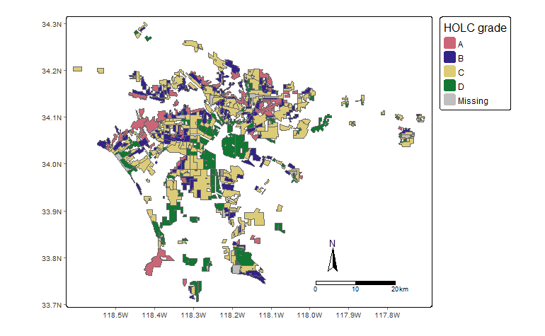

# Exploring the Legacy of Redlining on Environmental Justice in Los Angeles

## Overview

This project explores the impacts of historical redlining on current environmental justice issues in Los Angeles. Redlining, a discriminatory practice dating back to the 1930s, involved grading neighborhoods for loan eligibility, leading to disparities in community wealth, health, and environmental conditions. This analysis aims to uncover how these historical practices have shaped contemporary environmental and biodiversity patterns in Los Angeles.

## Data

The dataset associated with this project is too large for direct inclusion in this GitHub repository. Please download the data from the provided [Google Drive link](https://drive.google.com/file/d/1lcazRbNSmP8Vj9sH1AIJcO4D1d_ulJij/view?usp=share_link) to replicate the analysis. Unzip the folder and all the contents and store in your directory as follows.

```         
LA_Environmental_Justice_Redlining_Impact
│   .gitignore
│   README.md
│   Rmd/Proj files 
│
└───Report
    │   LA_Environmental_Justice_Redlining_Impact.html
    │   Blog_Post.html
    │   HOLC_map
│
└───data
    │   column descriptions: EJSCREEN_2023_BG_Columns.xlsx
    │   metadata explation: ejscreen-tech-doc-version-2-2.pdf
    │   spatial data: EJSCREEN_2023_BG_StatePct_with_AS_CNMI_GU_VI.gdb
    |   biodiversity data: gbif-birds-LA/gbif-birds-LA.shp
```

## Getting Started

1. **Clone the Repository**: Clone or download this repository to your local computer.
2. **Date Setup**: Download the data from the above link and place it in the `data` directory.
3. **Run the Analysis**: Open the R Markdown files in the `Rmd/Proj files` directory to view and run the analysis. Ensure you have installed all necessary R packages.

## Analysis Overview

The R Markdown files contain a detailed breakdown of the analysis process, including:

- Data loading and pre-processing.
- Spatial analysis of redlining impact on environmental factors.
- Examination of biodiversity data in relation to historical redlining areas.
- Visualizations and interpretation of findings.

## Redlining Map Visualization
Mapping redlining boundaries, colored by HOLC grade.

